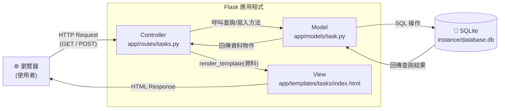

# 系統架構文件 — 任務管理系統

> 依據 `docs/PRD.md` 撰寫，技術限制：Python + Flask + Jinja2 + SQLite

---

## 1. 技術架構說明

### 1.1 選用技術與原因

| 技術 | 版本建議 | 採用原因 |
|------|---------|---------|
| **Python** | 3.10+ | 語法簡潔易讀，生態系豐富，適合快速開發 |
| **Flask** | 3.x | 輕量微框架，學習曲線低，路由設定直觀 |
| **Jinja2** | Flask 內建 | 與 Flask 深度整合，支援模板繼承，易於維護 HTML |
| **SQLite** | 內建於 Python | 零設定、單一檔案資料庫，完全符合個人任務管理的規模 |
| **SQLAlchemy** | 2.x（選用）| 提供 ORM 抽象層，防止 SQL Injection，程式碼可讀性高 |

### 1.2 Flask MVC 模式說明

本專案採用 **MVC（Model-View-Controller）** 架構，各層職責如下：

| 層級 | 對應目錄 | 職責 |
|------|---------|------|
| **Model（模型）** | `app/models/` | 負責與資料庫溝通；定義資料表結構、執行 CRUD 操作 |
| **View（視圖）** | `app/templates/` | 負責 HTML 頁面呈現；使用 Jinja2 語法渲染動態資料 |
| **Controller（控制器）** | `app/routes/` | 負責接收 HTTP 請求、呼叫 Model 取得資料、選擇對應 View 回傳 |

---

## 2. 專案資料夾結構

```
task-manager/                  ← 專案根目錄
│
├── app/                       ← 主應用程式套件
│   ├── __init__.py            ← 初始化 Flask app、註冊 Blueprint、設定 SQLAlchemy
│   │
│   ├── models/                ← Model 層：資料庫模型定義
│   │   ├── __init__.py
│   │   └── task.py            ← Task 資料表的 ORM 類別與相關查詢方法
│   │
│   ├── routes/                ← Controller 層：Flask 路由（Blueprint）
│   │   ├── __init__.py
│   │   └── tasks.py           ← 任務相關路由（新增、刪除、切換狀態、篩選）
│   │
│   ├── templates/             ← View 層：Jinja2 HTML 模板
│   │   ├── base.html          ← 共用版型（導覽列、頁首、頁尾）
│   │   └── tasks/
│   │       └── index.html     ← 主頁面：任務清單、新增表單、篩選按鈕
│   │
│   └── static/                ← 靜態資源（瀏覽器直接存取）
│       ├── css/
│       │   └── style.css      ← 自訂樣式
│       └── js/
│           └── main.js        ← 前端互動腳本（選用，例如刪除確認提示）
│
├── instance/                  ← 環境隔離目錄（Flask 預設不納入版控）
│   └── database.db            ← SQLite 資料庫檔案
│
├── app.py                     ← 應用程式進入點（啟動 Flask dev server）
├── config.py                  ← 設定檔（資料庫路徑、Secret Key 等）
├── requirements.txt           ← Python 套件清單
└── README.md                  ← 專案說明文件
```

---

## 3. 元件關係圖

### 3.1 請求 / 回應流程



### 3.2 各元件文字說明

```
[瀏覽器]
    │  ① 使用者送出 HTTP 請求（GET 瀏覽清單 / POST 新增任務）
    ▼
[Flask Route — app/routes/tasks.py]
    │  ② 解析請求參數（表單資料、查詢字串）
    │  ③ 呼叫 Model 的方法
    ▼
[Model — app/models/task.py]
    │  ④ 透過 SQLAlchemy 執行 SQL（INSERT / SELECT / UPDATE / DELETE）
    ▼
[SQLite — instance/database.db]
    │  ⑤ 回傳查詢結果
    ▲
[Model]
    │  ⑥ 將資料物件傳回給 Route
    ▲
[Flask Route]
    │  ⑦ 呼叫 render_template()，傳入資料
    ▼
[Jinja2 Template — app/templates/tasks/index.html]
    │  ⑧ 將資料嵌入 HTML，產生最終頁面
    ▼
[瀏覽器]  ← 收到完整 HTML 頁面
```

---

## 4. 關鍵設計決策

### 決策 1：採用 Blueprint 組織路由

**做法**：將任務相關路由獨立為 `tasks` Blueprint，於 `app/__init__.py` 統一註冊。  
**原因**：即使目前只有一個模組，Blueprint 從一開始就讓結構清晰，未來若新增「使用者」、「標籤」等模組，不需重構 app 核心。

---

### 決策 2：透過 SQLAlchemy ORM 取代原生 SQL

**做法**：使用 `Flask-SQLAlchemy` 定義 `Task` 模型類別；所有資料操作都透過 ORM 方法（`db.session.add()`、`Task.query.filter_by()` 等）。  
**原因**：
- 防止 **SQL Injection**（ORM 會自動處理參數化查詢）
- 程式碼更直觀，符合 Python 物件思維
- 日後若需換用 PostgreSQL，只需更改設定，不需改 Model 程式碼

---

### 決策 3：Server-Side Rendering（SSR）而非前後端分離

**做法**：所有頁面由 Flask Route 呼叫 `render_template()` 回傳完整 HTML，無 REST API / JSON。  
**原因**：
- 符合 PRD 技術限制（Jinja2 模板）
- 降低複雜度，初學者更容易理解資料流
- 任務管理的資料量輕量，不需要 SPA 的複雜性

---

### 決策 4：使用 `instance/` 目錄存放資料庫

**做法**：SQLite 檔案路徑設為 `instance/database.db`，並在 `.gitignore` 中排除 `instance/`。  
**原因**：
- Flask 的 `instance/` 資料夾設計本身就是放「部署環境特定設定」的位置
- 避免誤將含有真實資料的資料庫推上 Git（資料安全）
- 不同開發者 clone 後，各自產生自己的本地資料庫

---

### 決策 5：模板繼承（Template Inheritance）共用版型

**做法**：建立 `base.html` 作為基礎版型，其他頁面用 `` 繼承。  
**原因**：
- 導覽列、`<head>` 標籤、CSS 引用等共用元素只需維護一份
- 增加新頁面時，只需撰寫該頁面的差異內容
- 符合 DRY（Don't Repeat Yourself）原則

---

## 5. 下一步（建議執行順序）

1. **資料庫設計** → 執行 `/db-design` skill，定義 `tasks` 資料表欄位與 Schema
2. **API / 路由設計** → 執行 `/api-design` skill，規劃所有 URL 與 HTTP 方法
3. **使用者流程圖** → 執行 `/flowchart` skill，視覺化操作路徑
4. **實作** → 執行 `/implementation` skill，逐步建立 Model、Route、Template
