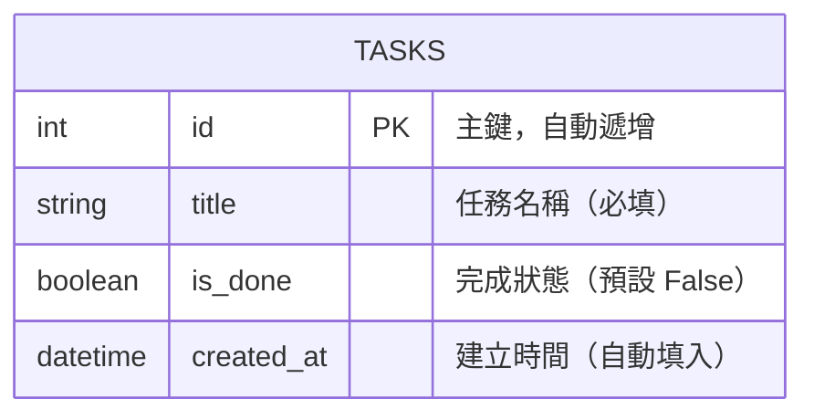

# 資料庫設計文件 — 任務管理系統

> 依據 `docs/PRD.md`、`docs/ARCHITECTURE.md`、`docs/FLOWCHART.md` 撰寫  
> 使用技術：SQLite + SQLAlchemy ORM

---

## 1. ER 圖（實體關係圖）

本系統 MVP 階段僅需一張核心資料表 `tasks`，無跨表關聯。



---

## 2. 資料表詳細說明

### 資料表：`tasks`

儲存使用者建立的所有任務項目。

| 欄位名稱 | 資料型別 | 必填 | 預設值 | 說明 |
|---------|---------|------|-------|------|
| `id` | `INTEGER` | ✅ | 自動遞增 | 主鍵（Primary Key），每筆任務的唯一識別碼 |
| `title` | `TEXT` | ✅ | 無 | 任務名稱，不可為空字串 |
| `is_done` | `BOOLEAN` | ✅ | `False` | 任務完成狀態；`False` = 未完成，`True` = 已完成 |
| `created_at` | `DATETIME` | ✅ | 當下時間 | 任務建立的時間戳記，用於排序顯示 |

**Primary Key：** `id`  
**Foreign Key：** 無（MVP 單表設計）

---

## 3. SQL 建表語法

完整 SQL 語法請參考 [`database/schema.sql`](../database/schema.sql)。

```sql
CREATE TABLE IF NOT EXISTS tasks (
    id         INTEGER  PRIMARY KEY AUTOINCREMENT,
    title      TEXT     NOT NULL,
    is_done    BOOLEAN  NOT NULL DEFAULT 0,
    created_at DATETIME NOT NULL DEFAULT (datetime('now', 'localtime'))
);
```

---

## 4. 設計說明

### 為什麼只有一張資料表？

PRD 的 MVP 范圍定義的五個功能（新增、顯示、切換狀態、刪除、篩選）**全部都可以用單一 `tasks` 表完成**，不需要引入多表關聯，降低初學者的學習門檻。

### `is_done` 使用 BOOLEAN 而非 TEXT

- SQLite 實際上以 `0 / 1` 整數儲存 BOOLEAN
- SQLAlchemy 的 `Boolean` 型別會自動做轉換，Python 程式碼可直接用 `True / False` 操作
- 相比用 `TEXT` 存 `'pending' / 'done'`，更簡單直觀且節省空間

### `created_at` 使用 DATETIME

- 預設值 `datetime('now', 'localtime')` 由 SQLite 自動填入當地時間
- 排序任務清單時以此欄位由新到舊排列，確保使用者永遠看到最新建立的任務在上方

---

## 5. 下一步（建議執行順序）

1. **API / 路由設計** → 執行 `/api-design` skill，根據 FLOWCHART.md 展開完整路由規格
2. **實作** → 執行 `/implementation` skill，逐步建立 Model、Route、Template
