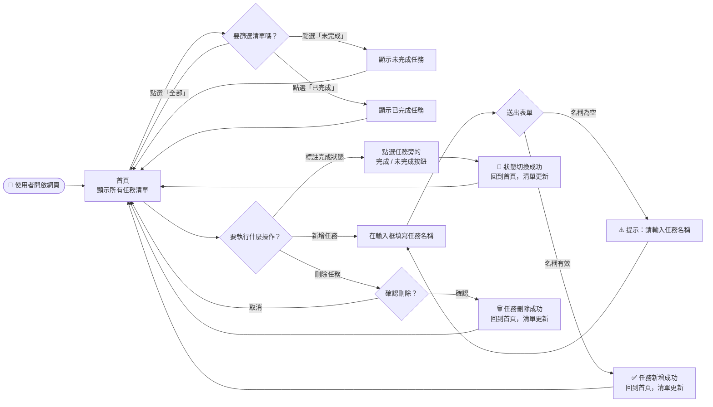
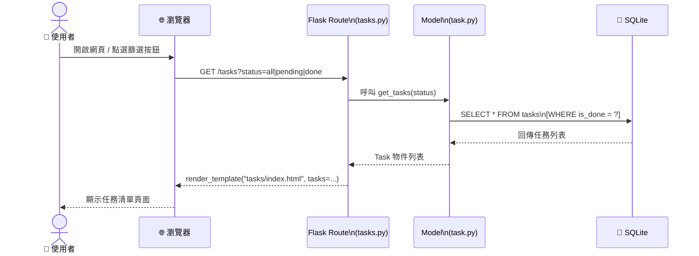
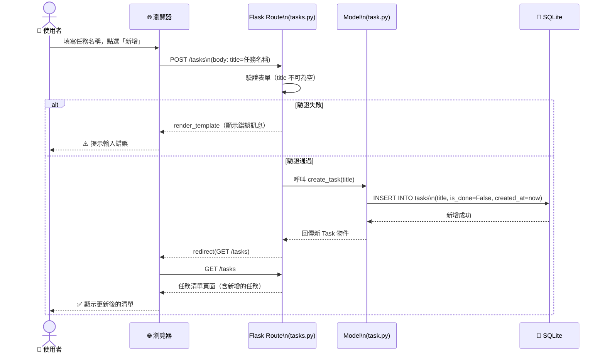
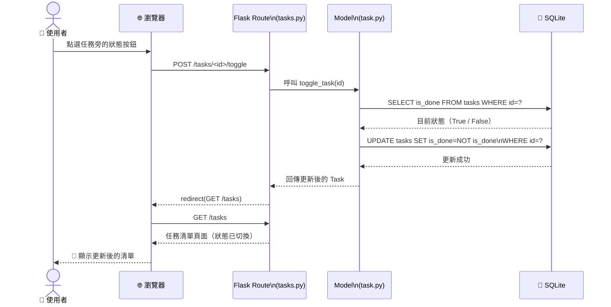
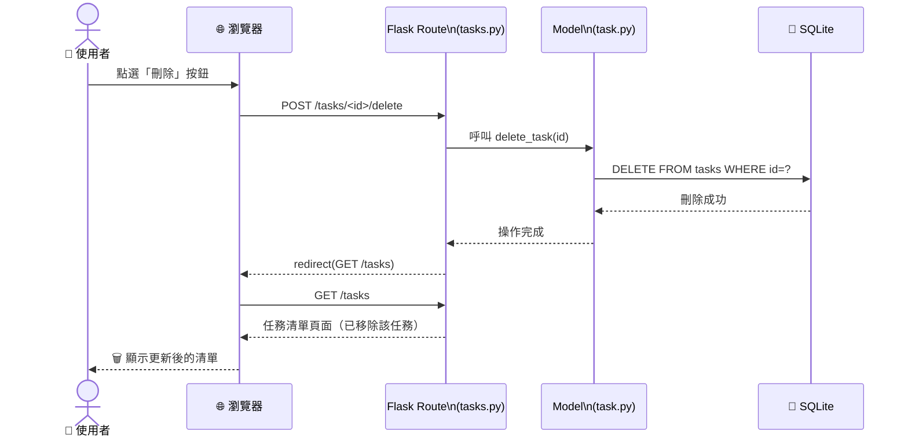

# 流程圖文件 — 任務管理系統

> 依據 `docs/PRD.md` 與 `docs/ARCHITECTURE.md` 撰寫

---

## 1. 使用者流程圖（User Flow）

描述使用者從開啟網站到完成各項操作的完整路徑。

---

## 2. 系統序列圖（System Sequence Diagrams）

描述使用者操作觸發後，系統各元件之間的資料傳遞順序。

### 2.1 查看任務清單（含篩選）

---

### 2.2 新增任務

---

### 2.3 切換任務完成狀態

---

### 2.4 刪除任務

---

## 3. 功能清單對照表

| 功能 | URL 路徑 | HTTP 方法 | Controller 動作 | 說明 |
|------|---------|----------|----------------|------|
| 顯示所有任務 | `/tasks` | `GET` | `index()` | 取得所有任務並渲染清單頁面 |
| 依狀態篩選 | `/tasks?status=pending` | `GET` | `index()` | 加上 `status` 查詢參數進行篩選 |
| 新增任務 | `/tasks` | `POST` | `create()` | 接收表單資料，寫入資料庫後重導向 |
| 切換完成狀態 | `/tasks/<id>/toggle` | `POST` | `toggle()` | 翻轉指定任務的 `is_done` 欄位 |
| 刪除任務 | `/tasks/<id>/delete` | `POST` | `delete()` | 從資料庫中移除指定任務 |

> 📌 **說明**：因為 HTML 表單僅支援 `GET` 與 `POST`，修改與刪除操作統一使用 `POST` 方法，不使用 `PUT` / `DELETE`。

---

## 4. 下一步（建議執行順序）

1. **資料庫設計** → 執行 `/db-design` skill，定義 `tasks` 資料表欄位與 Schema
2. **API / 路由設計** → 執行 `/api-design` skill，根據上方功能對照表展開完整路由規格
3. **實作** → 執行 `/implementation` skill，逐步建立 Model、Route、Template
